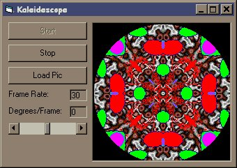



## Kaleidescope

### Description

This code demonstrates the technique of writing direct to graphical memory in a Kaleidescope. The technique basically maps an array to a bitmap address. Changes to the array then affect the bitmap. I first saw this method used by Simon Price.
 
### More Info
 
No necessary inputs, although the user can enter his/her own bitmaps

If you do make your own bitmaps, they must be 256 colour (8bit) and square. The sides should be an even number of pixels. The largest bitmap I've tried is 624x624 pixels.

             |
---                |---
**Submitted On**   |2000-10-16 17:05:40
**By**             |[Bill Soo](https://github.com/Planet-Source-Code/PSCIndex/blob/master/ByAuthor/bill-soo.md)
**Level**          |Intermediate
**User Rating**    |5.0 (25 globes from 5 users)
**Compatibility**  |VB 6\.0
**Category**       |[Graphics](https://github.com/Planet-Source-Code/PSCIndex/blob/master/ByCategory/graphics__1-46.md)
**World**          |[Visual Basic](https://github.com/Planet-Source-Code/PSCIndex/blob/master/ByWorld/visual-basic.md)
**Archive File**   |[CODE\_UPLOAD1075110182000\.zip](https://github.com/Planet-Source-Code/bill-soo-kaleidescope__1-12132/archive/master.zip)

### API Declarations

Uses RTLMoveMemory, GetObject

